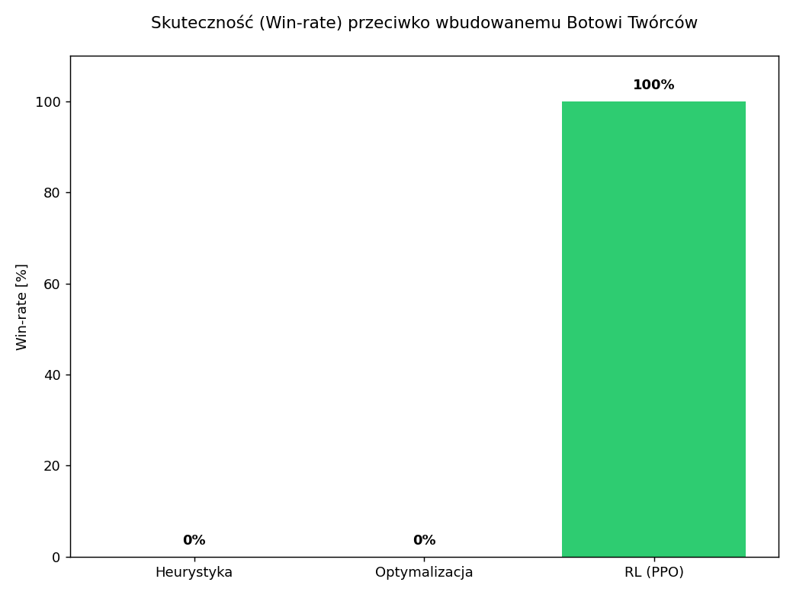
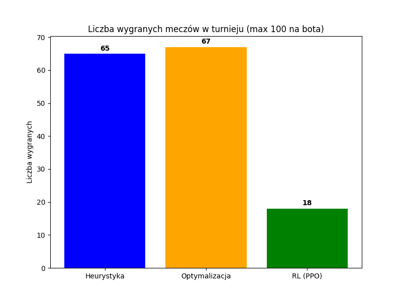
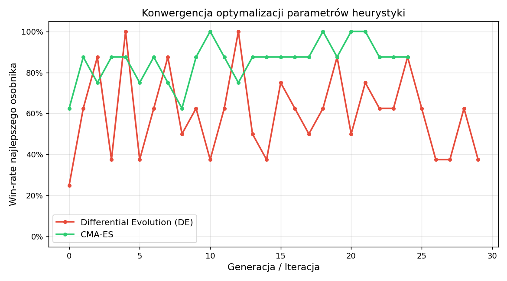
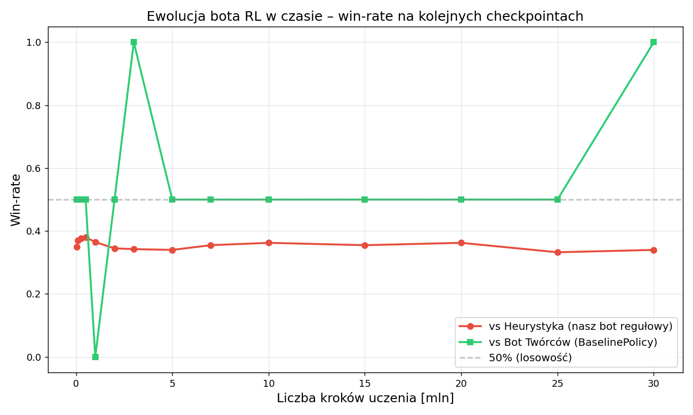

# Raport Projektowy: Sztuczna Inteligencja w Grach - Slime Valley

## 1. Wstęp i definicja problemu

Projekt dotyczy zaimplementowania i porównania różnych podejść do sterowania agentem (tzw. "Slimem") w środowisku "Slime Valley" (klon Slime Volleyball). Celem gry jest odbijanie piłki w taki sposób, aby spadła ona po stronie przeciwnika, zapobiegając jednocześnie jej upadkowi na własnej połowie. Gra toczy się do określonej liczby zdobytych punktów.

**Wejścia i Wyjścia:**
- **Wejście (Obserwacja):** Agent widzi stan środowiska reprezentowany przez wektor liczbowy (12-wymiarowy). Wektor ten zawiera kluczowe informacje fizyczne o środowisku m.in.: położenie własnego Slime'a (x, y), wektor jego prędkości (vx, vy), położenie i prędkość przeciwnika, oraz położenie i prędkość piłki.
- **Wyjście (Akcja):** Decyzje agenta to wektor dyskretnych binarnych akcji, reprezentujących wciśnięcia klawiszy sterujących: poruszanie się w lewo, w prawo oraz skok. Istnieje 8 możliwych unikalnych kombinacji tych akcji (współdzielących 3 przyciski: przód, tył, skok).

**Funkcja celu:**
Podczas uczenia, ocena zachowań (fitness/nagroda) jest jednokryterialna – polega na maksymalizacji różnicy między punktami zdobytymi a straconymi, ujętej jako skumulowana nagroda za wygranie wymiany (rajdu), gdzie zdobycie punktu to +1, a utrata to -1.

---

## 2. Metodologia i Opis Podejść

W ramach projektu przygotowano i zbadano trzy odmienne podejścia, które w szczegółach zostały opisane poniżej.

### 2.1. Heurystyka (Podejście eksperckie `if/else`)
Została zaimplementowana w oparciu o sztywne reguły decyzyjne bazujące na prawach fizyki świata 2D (tzw. podejście odgórne). W pliku `heuristic.py` zaimplementowano predykator zjawisk oraz drzewo zachowań.
Zasada działania opiera się na dwóch głównych filarach:
1. **Przewidywanie trajektorii i celu (Target Tracking):** 
   Na podstawie równań ruchu jednostajnie przyspieszonego i uwzględnieniu siły grawitacji (`ball_gravity`), agent symuluje do 45 klatek w przód trajektorię lotu piłki w wirtualnej pętli. Funkcja `_predict_landing_x` wylicza dokładny punkt upadku piłki na osi X (`landing_x`). Zaimplementowano także odbicia od wirtualnych ścian (jeśli estymowany x przekroczy `court_half_width`, jego wektor prędkości w pętli predykcyjnej jest odwracany i wyliczane jest rykoszetowe `landing_x`).
2. **Drzewo decyzyjne (Akcje if/else):** 
   - Jeżeli z predykcji wynika, że piłka spadnie na naszą połowę (`ball_on_our_side` i `reachable_landing`), bot nakierowuje swojego agenta, definiując `target_x = landing_x`.
   - Jeżeli piłka jest u przeciwnika wysoko w górze, skrypt narzuca odwrót do pozycji obronnej: `target_x = retreat_x` (domyślnie `18.5`).
   - W przypadku piłek bardzo blisko siatki, bot wylicza pozycje podsunięcia się tuż pod piłkę ze specjalnym offsetem (`under_ball_bias`).
   - **Skok** jest inicjowany tylko wtedy, gdy uruchomione zostaną konkretne flagi zdefiniowane poprzez tzw. *bounding boxy*. Np. flaga `attack_jump` zapali się tylko gdy spełnione będą twarde warunki relacji agent-piłka: `abs(ball_x - x) < 2.6` (odległość w poziomie), `y + 3.0 < ball_y < y + 11.5` (piłka nad agentem) oraz `ball_vy < 2.0` (piłka już spada). Skrypt zakłada również chłodzenie po każdym skoku zapobiegając "spamowaniu" spacji.

### 2.2. Optymalizacja (Podejście ewolucyjne - CMA-ES/DE)
Agent zoptymalizowany nie zmienia praw zaimplementowanej wcześniej heurystyki, lecz dostosowuje i tunuje jej **parametry progowe i wartości graniczne**, które w podstawowej wersji eksperckiej były wpisane "na sztywno".
Stworzyliśmy wrapper optymalizujący 12 zmiennych ciągłych opisujących zachowanie, w tym m.in.:
- `defend_x` (optymalna pozycja na korcie w oczekiwaniu na atak, zakres [8.0, 20.0]),
- `intercept_x` (pozycja przechwytu szybkiej piłki przy siatce, zakres [6.0, 16.0]),
- `high_ball_y` (próg wysokości, powyżej którego piłkę uznajemy za lob, zakres [8.0, 18.0]),
- `falling_ball_vy` (od jakiej prędkości pionowej w dół piłkę uznajemy za spadającą na ziemię).

Użyliśmy algorytmów bezgradientowych z biblioteki `scipy`: strategii ewolucyjnej z adaptacją macierzy kowariancji (CMA-ES) oraz Differential Evolution (DE) z wielkością populacji ok. 12 osobników. Funkcją fitness ewaluowaną dla każdego z osobników populacji był procent wygranych (`win-rate`) w paczce 10 gier z rzędu w trybie headless, podlegający minimalizacji przez odwrócenie znaku.

### 2.3. Uczenie ze wzmocnieniem (RL - PPO)
Zastosowano algorytm Proximal Policy Optimization (PPO) z biblioteki Stable-Baselines3. Zamiast logiki `if/else`, agent wykorzystywał architekturę głębokiej wielowarstwowej sieci neuronowej (MlpPolicy). 
- Całe środowisko (wykorzystujące stare API Gym) zostało zwrapowane w nowszy standard Gymnasium (`GymToGymnasiumWrapper`), co ujednoliciło przesyłanie przestrzeni akcji i obserwacji.
- Środowisko uruchomiono wektoryzowane (do 4 instancji naraz) przy użyciu `DummyVecEnv`, co skróciło czas prób.
- Agent trenował się samodzielnie przez wybitnie długi czas ok. **30 milionów interakcji (kroków) ze środowiskiem**. 
- **System nagród (Reward Function):** Zastosowano system tzw. "rzadkich nagród" (Sparse Rewards). Agent otrzymywał nagrodę `+1` wyłącznie za zdobycie punktu w rajdzie oraz karę `-1` za jego utratę. W środowisku nie wprowadzono żadnych dodatkowych nagród pomocniczych (np. za samo uderzenie piłki), co wymusiło na algorytmie samodzielne odkrycie złożonych sekwencji ruchów prowadzących do celu (problem *credit assignment*).
- **Hiperparametry PPO:** Współczynnik uczenia (`learning_rate`) ustawiono na 3e-4 z odpowiednim clippingiem (0.1), parametrem gamma na 0.99. Kluczowym było obniżenie współczynnika entropii (`ent_coef`) do poziomu **0.001**. Przy rzadkich nagrodach zbyt wysoka entropia powodowała, że agent "bał się" podejmować konkretne akcje, trwając w stanie chaotycznego ruchu. Obniżenie tego parametru pozwoliło na szybszą stabilizację polityki (wykorzystanie wiedzy zamiast ciągłej eksploracji).

---

## 3. Analiza Ilościowa (Twarde dane) i Zjawisko Kamień-Papier-Nożyce

Rozegrane mecze w paczkach po 50 spotkań pokazały niesamowity dla Sztucznej Inteligencji, wręcz książkowy rozkład sił bazujący na pętli oponowania.

### 3.1. Skuteczność przeciwko Domyślnemu Przeciwnikowi (Wbudowany Bot Twórców)
Najpierw wystawiono wszystkie stworzone algorytmy przeciwko wbudowanemu w silnik, niezależnemu i ekstremalnie silnemu botowi napisanemu przez twórców samego silnika `SlimeVolleyEnv`:

- **Heurystyka i Optymalizacja:** Zderzają się ze ścianą i **przegrywają niemal 100% starć**. Domyślny bot jest fenomenalnie zoptymalizowany pod kątem ostrych ścięć i uderzeń narożnikowych, za którymi twarda, ale toporna matematyka regułowa nie nadąża.
- **RL (PPO):** Wykazuje z nim **stuprocentową skuteczność**. Przez 30 milionów kroków bot RL "przeuczył" się (Overfitting) na domyślnym agencie, dzięki czemu wykształcił absolutną obronę. Każda wymiana między nim a Botem Twórców kończy się nieskończonym rajdem (uderzenia odbijane są w nieskończoność bez żadnego błędu ze strony PPO), udowadniając całkowitą wyższość sieci nad hardkodowanym skryptem przeciwnika.

### 3.2. Wielki Turniej Wewnętrzny (Cross-play naszych algorytmów)
Gdy jednak odstawiono Bota Twórców i zainicjowano turniej po 50 gier "każdy z każdym" pomiędzy naszymi autorskimi logikami, wykresy pokazały druzgocącą niespodziankę:

Tutaj, Agent RL który jeszcze przed chwilą miażdżył rywali, wygrywa zaledwie garstkę spotkań (18 z 100 stoczonych meczów w turnieju). Zwycięstwo zgarnia bot Optymalizacyjny do spółki z Heurystyką. Zjawisko to w teorii gier udowadnia, że optymalna polityka przeciwko jednemu graczowi jest fatalna przeciwko innemu - RL wyćwiczył genialne pozycjonowanie na arcyszybkie odbicia od bota twórców, ale padł ofiarą "zbyt chaotycznej, powolnej gry" naszego bota heurystycznego, z którym wcześniej nigdy nie grał.

### 3.3. Krzywe Uczenia 
Poniżej widać przebieg konwergencji funkcji (zbiegania się krzywych uczenia) w trakcie procesu optymalizacji parametrów, przeprowadzony w izolowanym środowisku testowym.

W przypadku bota RL wygenerowano wykres ewolucji na podstawie ewaluacji 14 checkpointów (od 50K do 30M kroków), testując każdy w dwóch warunkach równolegle:

Wykres ukazuje fundamentalny podział na dwa trajektorie:
- **Krzywa zielona (vs Bot Twórców):** oscyluje przez kilka pierwszych milionów kroków wokół ~0.5 (rajdy bez punktowanego zakończenia = remisy), a następnie przy **3M i 30M** osiąga 1.0 – RL opanował perfekcyjną obronę przed tym konkretnym stylem gry.
- **Krzywa czerwona (vs Heurystyka):** ustabilizowała się na poziomie ~0.35 i **nigdy nie rośnie** pomimo dalszego treningu – jest to empiryczny dowód zjawiska **"Overfittingu na wrogu"** – agent coraz lepiej pokonuje jeden styl gry kosztem ogólności.

---

## 4. Analiza Jakościowa (Obserwacje zachowań w renderingu)

Wyciągnięcie samych suchych danych bywa niepełne. Przez obserwację klatek animacji zidentyfikowano następujące jakościowe wskaźniki działania algorytmów:

1. **Agent Heurystyczny i Optymalizacja:**
   Ruch bota heurystycznego jest schematyczny. Bot podąża za trajektorią z opóźnieniem zależnym od przyspieszenia wirtualnej grawitacji. Gdy piłka leci idealnie w środek kortu, bot elegancko wraca na "defend_x" i wybija piłkę w wysoki lob. Optymalizacja ewolucyjna sprawiła, że zmienna pozycjonowania i `intercept_x` przesunęła środek ciężkości bota nieco do tyłu, minimalizując błędy tracenia piłki rykoszetem od własnych pleców. Niemniej widać "robotyczność" i brak dynamiki w jego zachowaniach.
   
2. **Agent Uczenia ze Wzmocnieniem (PPO):**
   Tu z kolei mamy do czynienia z ruchem iście nadludzkim. Sieć PPO nie wykorzystuje równań. Jej ruch składa się z "mikro-drgań" (nieustanne, klatka w klatkę, odpalanie i gaszenie flag left/right). Taka polityka powoduje, że wirtualny Slime nie tyle odbija piłkę w odpowiednim miejscu, co niemal "przytula" się do hit-boxa piłki od spodu, pieszczotliwie przebijając ją z ułamkiem siły na sam rant siatki. Taka taktyka skutecznie niszczy każdego algorytmicznego oponenta, bo zjawisko mikroruchów jest nie do przewidzenia przez fizyczną symulację 45-klatkową używaną przez Heurystykę.

---

## 5. Porównanie Pracochłonności

Zestawienie prac deweloperskich i obliczeniowych wyglądało następująco:

| Podejście | Czas implementacji | Czas CPU (oczekiwania na wynik) | Łatwość modyfikacji/tuningu |
| :--- | :--- | :--- | :--- |
| **Heurystyka** | Największy (pisanie i debugowanie fizyki lotu paraboli, żmudne testowanie flag i kolizji) | Brak (algorytm jest twardy, wczytuje się w 0s) | Bardzo Trudna (każdy defekt wymaga przepisywania bloków kodu) |
| **Optymalizacja** | Średni (pisanie wrappera wokół konfiguracji i uruchomienie ewolucji SciPy) | Umiarkowany (zależnie od populacji, tysiące meczów do wygenerowania fitnessu) | Umiarkowana (algorytm dostraja liczby sam, trzeba dobierać granice) |
| **Uczenie (RL)** | Średni (głównie spięcie Gymnasium API z siecią i konfiguracja hiperparametrów) | **Gigantyczny** (trening przez ok. 30 milionów timestepów potrafi trwać bez przerwy dniami) | Łatwa (Agent uczy się całkowicie w pętli zamkniętej) |

---

## 6. Wnioski końcowe

Najlepiej ukształtowanym, wykazującym się największym kunsztem podejściem zbadanej sztucznej inteligencji okazało się z bezkompromisowym marginesem błędu głębokie **Uczenie Ze Wzmocnieniem (PPO)**. 

Paradoks, w którym PPO wręcz pożera najlepszego, wbudowanego Bota Twórców, ale przegrywa ze słabym skryptem Heurystyki, jest książkowym przykładem **"Przeuczenia na wrogu" (Overfittingu politycznego)** - agent PPO stał się idealnym anty-botem na algorytm twórców, ale za to podatnym na trywialne wrzutki prymitywnego algorytmu eksperckiego.

Eksperyment dowiódł, że czysta Heurystyka – pomimo inteligentnej konstrukcji `if/else` używającej twardych matematycznych wyliczeń trajektorii upadku piłki – ponosi totalną klęskę, gdy gra wkracza w fazę szybkich i chaotycznych odbić przy rogu mapy. Agent sieci neuronowej RL adaptuje i wykorzystuje wręcz same wady silnika fizycznego (tworząc zjawisko tzw. *exploitingu* mikroruchami), formując z tego strategię absolutnie nie do pojęcia dla tradycyjnej inżynierii programowania.
